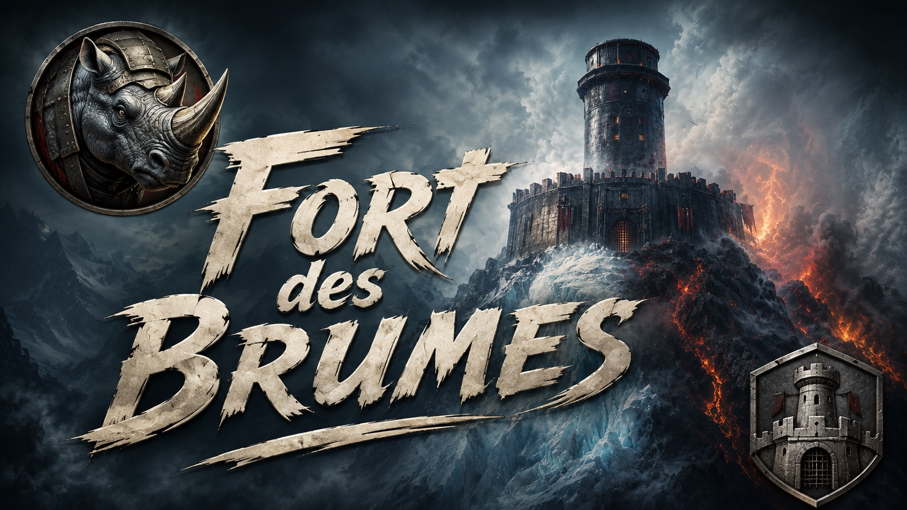
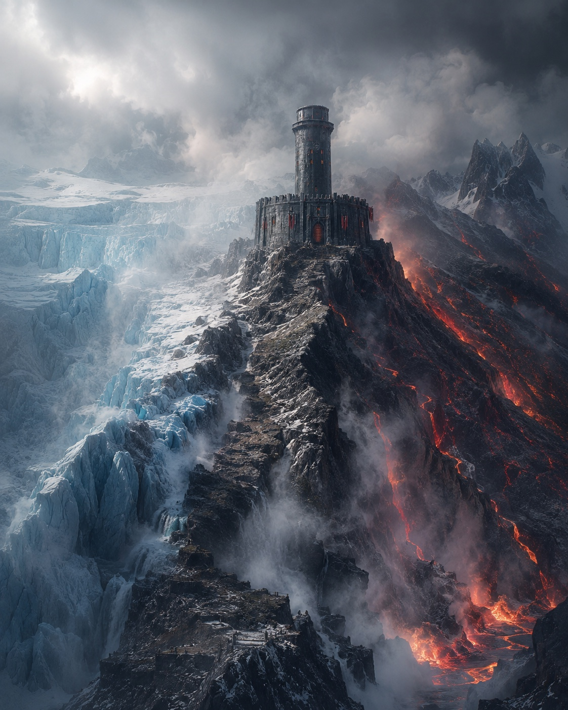
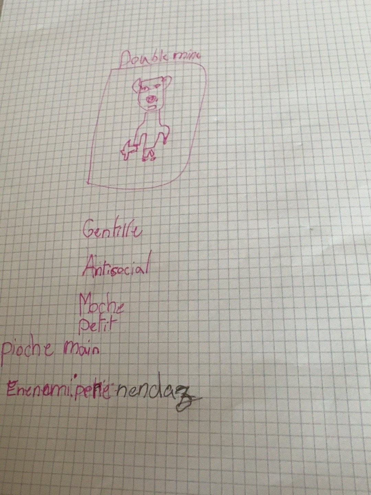
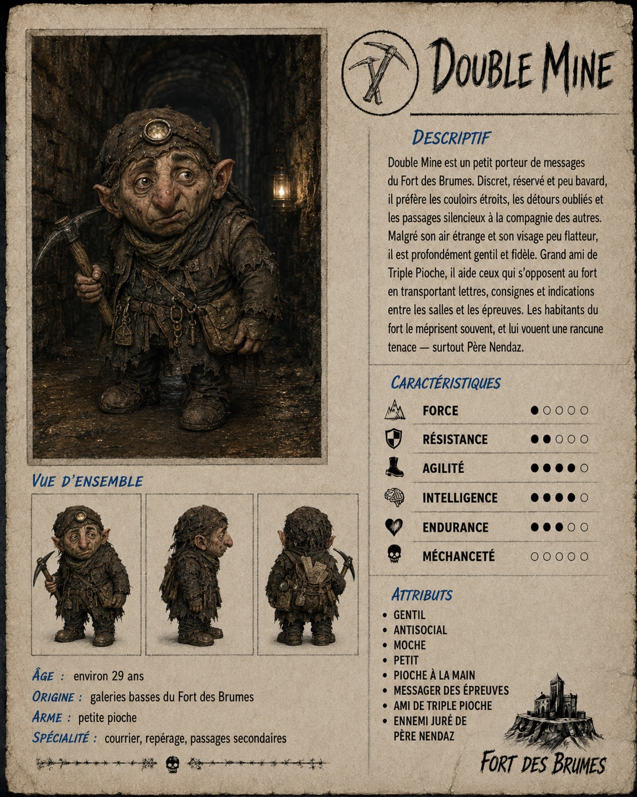
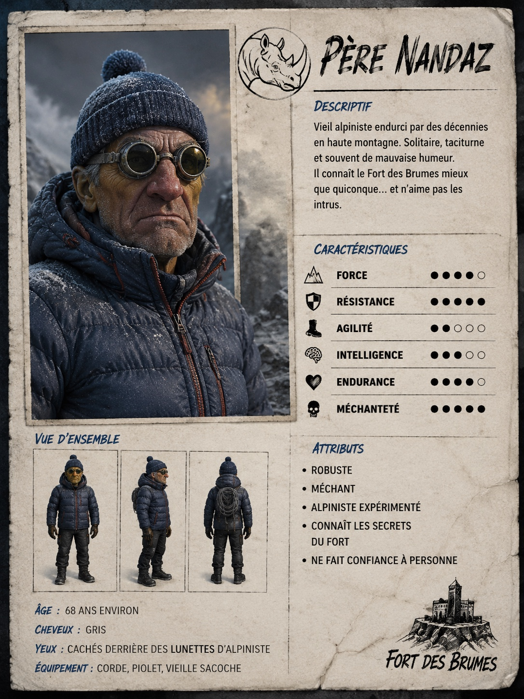
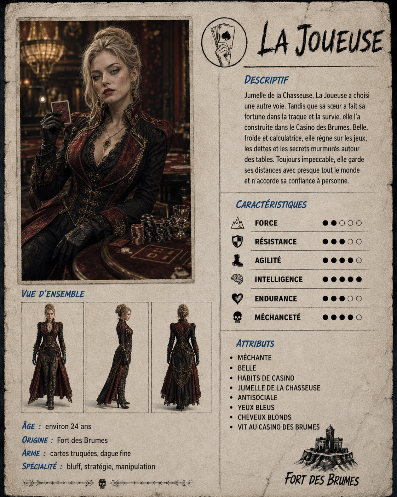
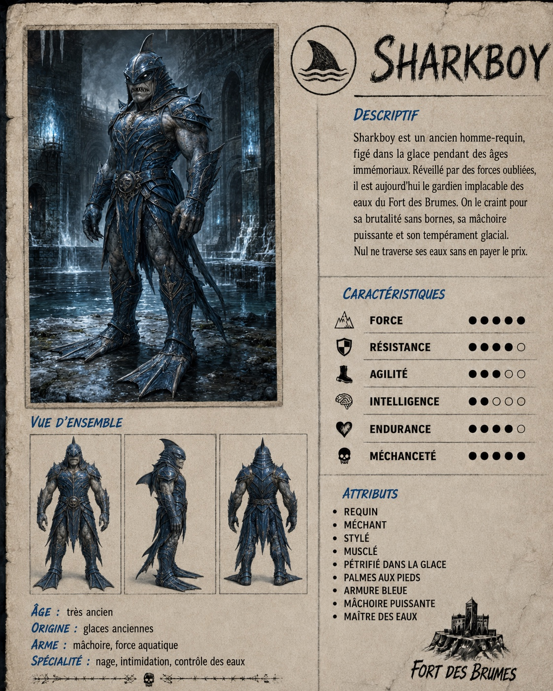
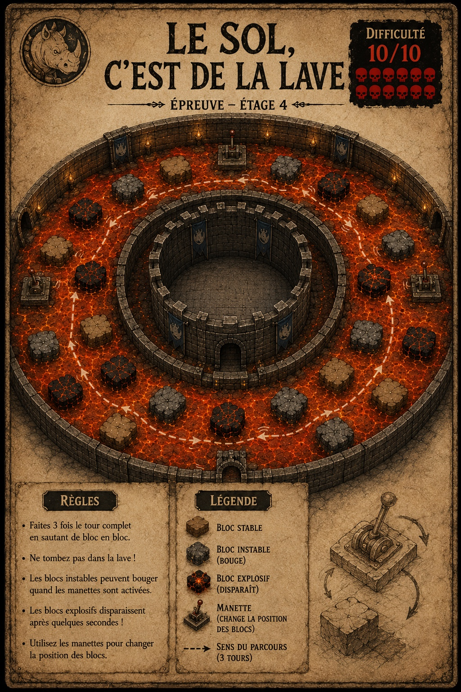

  

# Fort des Brumes

Un jeu d'action en 3D dans une **prison-forteresse circulaire**, bâtie sur une crête entre un
glacier colossal et un versant de lave. Les deux se rencontrent en contrebas et produisent sans
arrêt de la vapeur, de la brume et des roches instables. On progresse étage par étage, salle par
salle, à travers des épreuves de glace et de magma et les repaires des habitants du fort, jusqu'à
la salle du trésor gardée par deux rhinocéros.

Projet familial, en cours. Le concept est mené par un jeune chef de projet ; tout ce qui est écrit
ici est son idée, mise en forme. Rien n'est figé.

  

## Du croquis à la fiche

Chaque personnage, chaque salle commence par un dessin. Le dossier concept garde le croquis et la
fiche qui en est sortie, côte à côte.

<table align="center">
  <tr>
    <td align="center"></td>
    <td align="center"></td>
  </tr>
  <tr>
    <td align="center"><em>Double Mine, le croquis</em></td>
    <td align="center"><em>Double Mine, la fiche</em></td>
  </tr>
</table>

## Les habitants du fort

Dix personnages : huit qui vivent dans le fort et deux alliés qui aident les joueurs à l'affronter.
Le Père Nendaz et son bonnet d'alpiniste, la Joueuse du Casino des Brumes, Sharkboy pris dans la
glace, Lava Girl venue du volcan, le Cuistot et sa main-louche…

<table align="center">
  <tr>
    <td align="center"></td>
    <td align="center"></td>
    <td align="center"></td>
  </tr>
  <tr>
    <td align="center"><em>Père Nendaz</em></td>
    <td align="center"><em>La Joueuse</em></td>
    <td align="center"><em>Sharkboy</em></td>
  </tr>
</table>

Toutes les fiches : [personnages](concept/personnages/README.md).

## Les épreuves

Les épreuves viennent de jeux que tout le monde connaît, transformés par le fort. La plus
avancée, **Le sol, c'est de la lave**, occupe tout l'étage 4 : sauter de bloc en bloc — stables,
bancals, explosifs ou mobiles — pour faire trois tours complets autour de la tour centrale.
Difficulté : 10/10.

  

Toutes les épreuves : [épreuves](concept/epreuves/README.md). Les idées pas encore validées sont
dans [propositions](concept/propositions/README.md).

## Le dépôt

| Dossier | Contenu |
| --- | --- |
| [`concept/`](concept/README.md) | Le dossier de conception : univers, identité visuelle, personnages, niveaux, épreuves, galerie d'images, questions ouvertes |
| [`technique/`](technique/README.md) | Les décisions techniques, en ADR — moteur : [Godot 4](technique/adr/0001-moteur-godot-4.md), langage : [C#](technique/adr/0002-langage-csharp.md) |
| [`ROADMAP.md`](ROADMAP.md) | La feuille de route, par jalons |
| [`teaser/`](teaser/README.md) | Script et prompts du teaser vidéo, et [où le générer](teaser/outils.md) |

Le code du jeu viendra dans son propre dossier quand le premier prototype démarrera.

**Langue** : le projet est écrit en français, et le français sera la langue par défaut du jeu.

**Licence** : à définir. En attendant, tous droits réservés.
