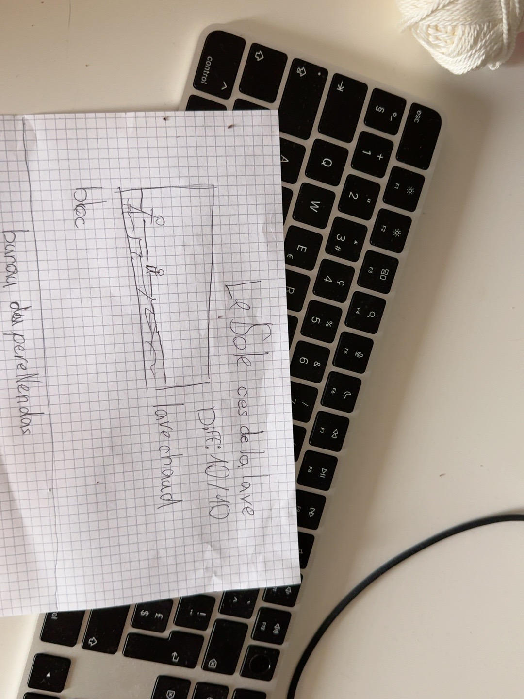

# Le sol, c'est de la lave

## Concept

Une immense salle contient énormément de lave. Les joueurs doivent sauter de bloc en bloc et accomplir **trois tours complets** du parcours circulaire.

## Difficulté

**10/10**

## Types de blocs

- **Blocs stables ou normaux** : décrits comme des blocs de terre ; une autre formulation les qualifie de légèrement noirs.
- **Blocs instables** : blocs de pierre bancals.
- **Blocs explosifs** : blocs noirs ou faits de magma, qui explosent.
- **Blocs mobiles** : certains changent de position pendant l'épreuve.

## Leviers

Des manettes sont placées à différents endroits. Elles modifient la position des rochers ou des blocs et changent donc le trajet disponible.

## Tour centrale

- La lave et le magma ne doivent pas toucher la tour centrale.
- Rien ne doit être installé dans la tour pour cette version du niveau.
- Un mur doit isoler la tour du magma.

## Direction de la carte concept

- Présenter l'épreuve comme une carte illustrée, dans le style des cartes de personnages.
- Ne pas la réduire à un plan technique vu du dessus.
- Faire une présentation longue et détaillée.
- Montrer clairement les trois catégories de danger, les blocs mobiles et les manettes.

## Historique

Une première version de l'étage prévoyait une vigie du Père Nendaz dans la tour. Les corrections ultérieures ont demandé une tour vide et un mur protecteur ; elles priment ici.

