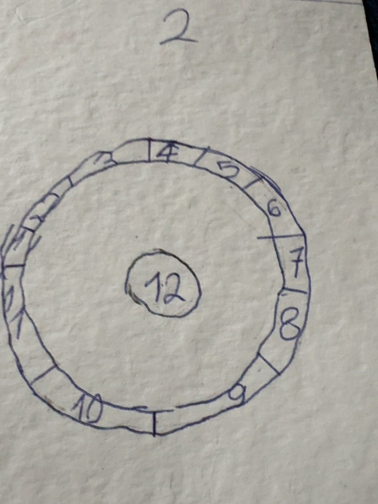

# Niveau 2 — galerie des personnages

## Fonction

Ce niveau est principalement la **galerie des personnages**. Il comporte leurs salles personnelles ainsi que trois épreuves.

## Épreuves

- [Magma vs Glace](../epreuves/magma-vs-glace.md)
- [Aviron sur glace](../epreuves/aviron-sur-glace.md)
- [Tempête de glace](../epreuves/tempete-de-glace.md)

## Salles de personnages

- **La Joueuse** : un casino, le Casino des Brumes.
- **Le Cuistot** : une cuisine.
- **Le Prisonnier fou** : une cellule.
- **Le Gardien des clés** : une chambre avec un plateau ou présentoir de clés.
- **La Chasseuse** : un bureau avec une chaise, de nombreux trophées et des murs en velours rouge.

## Exclusion

La salle du Père Nendaz ne se trouve pas à cet étage et doit être supprimée du plan.

## Révision

La première proposition visuelle des salles ne correspondait pas à l'intention. Les décors ci-dessus remplacent les pièces génériques initiales.

