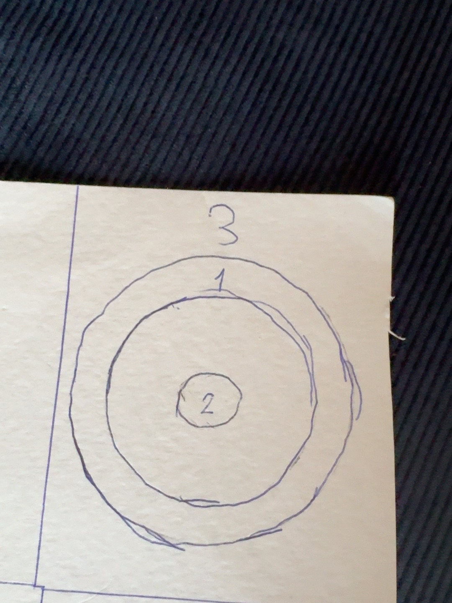

# Niveau 3 — étage de glace

> La numérotation « niveau 3 » est une déduction : la conversation parle du prochain étage après le niveau 2, puis nomme explicitement l'étage 4.

## Intention

Cet étage doit reprendre la qualité et le style du meilleur plan antérieur, tout en proposant un contenu entièrement nouveau consacré à la glace.

## Contraintes

- Créer uniquement des salles et épreuves sur le thème de la glace.
- Produire une carte plus grande et plus réaliste.
- Inventer de nouveaux noms de pièces et d'épreuves.
- Ne pas réutiliser **Magma vs Glace**, **Aviron sur glace** ni **Tempête de glace**.
- Ne pas inclure l'avant-antichambre, l'antichambre ou la salle du trésor.
- Ne pas inclure la salle de la Joueuse.
- Reprendre le langage graphique du plan apprécié, sans reprendre son contenu.

Les nouveaux noms proposés uniquement dans les images générées du chat ne sont pas accessibles dans l'import et devront être recréés.

