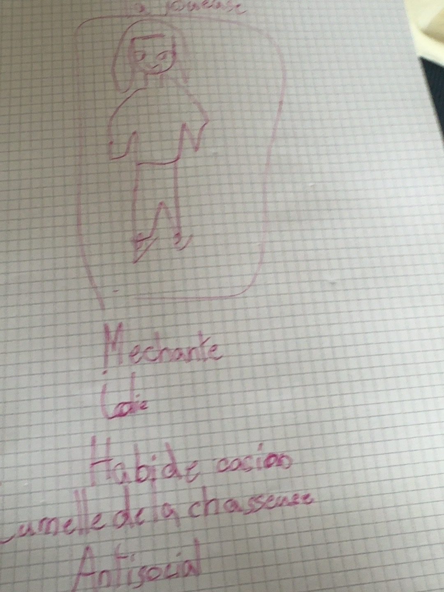

# La Joueuse

### Croquis source

## Rôle et histoire

La Joueuse vit dans le **Casino des Brumes**. Elle y a bâti sa fortune, tandis que sa sœur jumelle, la Chasseuse, a fait fortune par la chasse. Les jumelles se sont séparées et suivent désormais des chemins différents.

## Caractère

- Méchante.
- Très belle, davantage que Lava Girl.
- Antisociale, comme sa sœur.

## Apparence

- Vêtements inspirés du casino.
- Cheveux blonds.
- Yeux bleus.
- Peau extrêmement pâle.
- Lèvres bien rouges.
- Elle est particulièrement propre, contrairement à plusieurs autres habitants du fort.

## Salle

Sa salle doit prendre la forme d'un casino, et non d'une chambre ordinaire.
