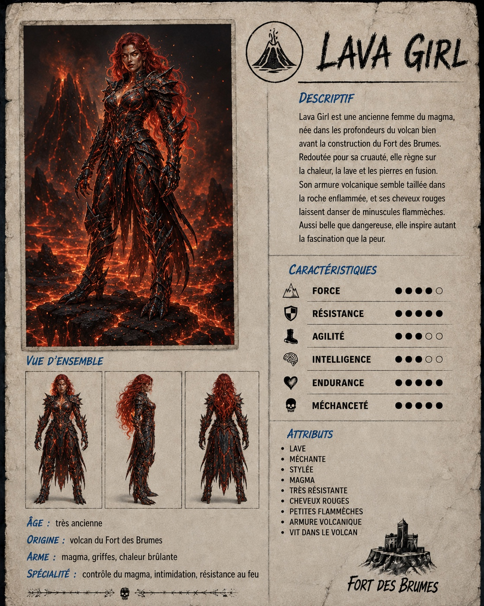
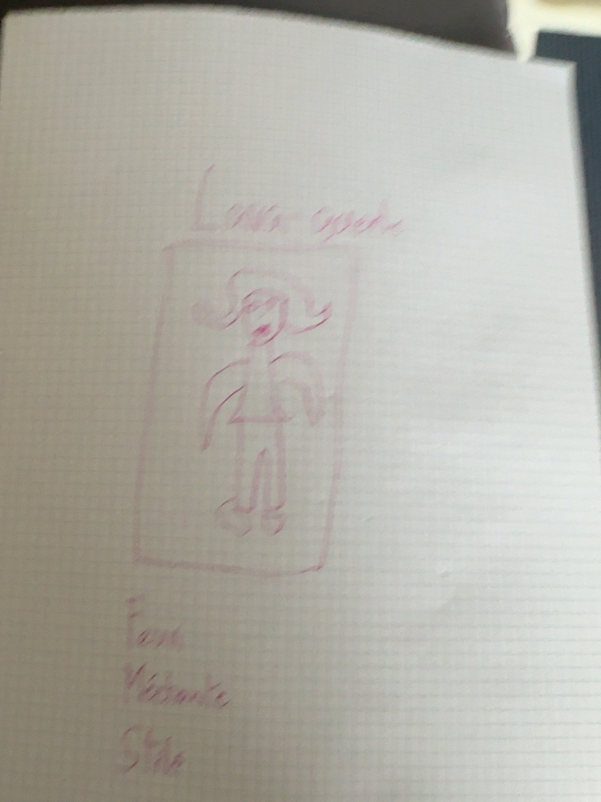

# Lava Girl

### Croquis source

## Origine et rôle

Lava Girl est le pendant volcanique de Sharkboy. Elle vivait dans le volcan avant la construction du Fort des Brumes et appartient naturellement à l'univers de la lave et du magma.

## Caractère

- Très méchante.
- Jolie, mais moins belle que la Joueuse.

## Apparence

- Cheveux rouges.
- Les cheveux semblent brûler avec de **minuscules flammèches**, jamais de grandes flammes.
- Armure de magma, construite dans le même esprit que l'armure de Sharkboy.
- Elle supporte naturellement la lave.

## Univers visuel

Elle doit être présentée dans un environnement volcanique.
