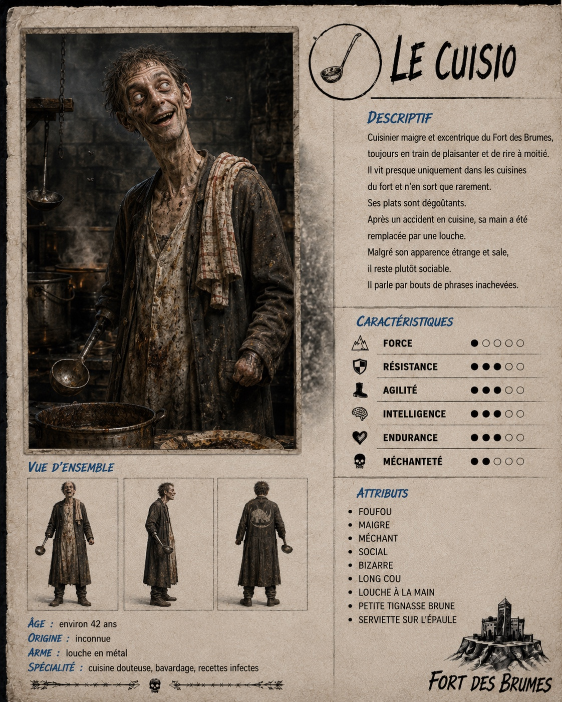
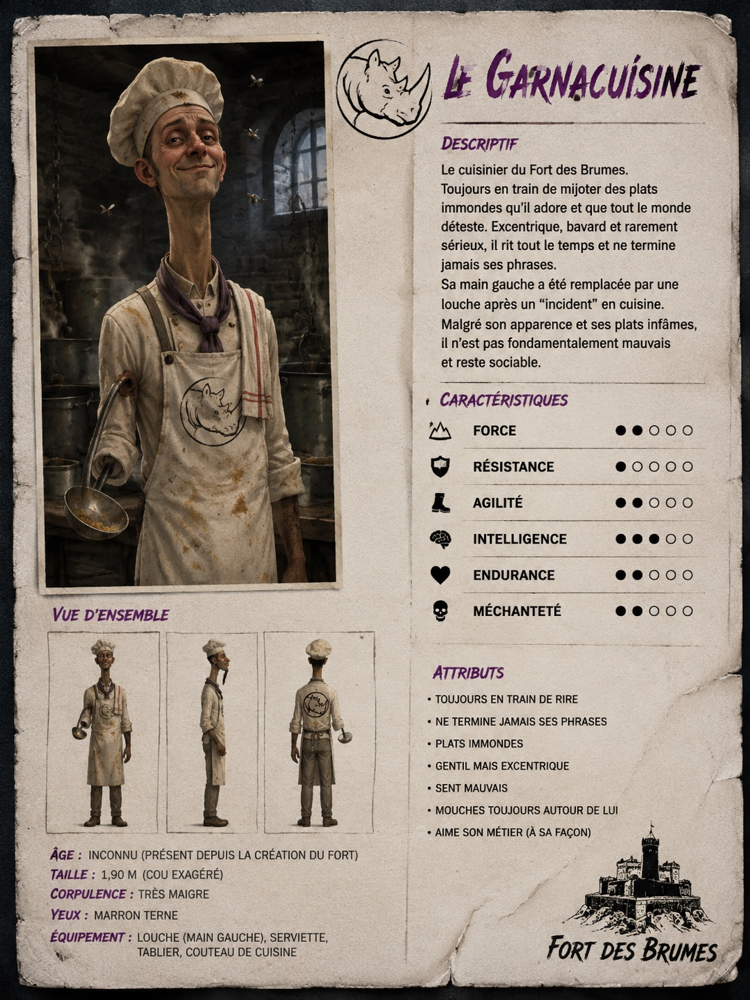

# Le Cuistot

Les titres « Le Cuisio » et « Le Garnacuisinier » visibles dans ces essais sont des variantes générées. Le nom canonique retenu après correction est **Le Cuistot**.

## Rôle

Le Cuistot prépare dans sa cuisine les plats particulièrement dégoûtants du fort.

## Caractère

- Pas vraiment très méchant, mais tout de même un peu mauvais.
- Social.
- « Foufou » : il rit presque tout le temps.
- Il ne termine souvent pas ses phrases.

## Apparence

- Très maigre.
- Long cou.
- Manteau ou blouson assez long.
- Une main a été remplacée par une louche après avoir été coupée lors d'un accident de cuisine.
- Serviette portée sur l'épaule.
- Quelques taches de sauce sur les vêtements.
- Mauvaise odeur et mouches qui tournent autour de lui.
- Rhinocéros du fort au dos du blouson.

## Révision visuelle

La version corrigée doit avoir **moins de taches**. Le Cuistot essaie de prendre une pose correcte : on voit que cela lui est difficile, mais aussi qu'il fait sincèrement un effort.

## Salle

Une cuisine reconnaissable, plutôt qu'une pièce générique.
