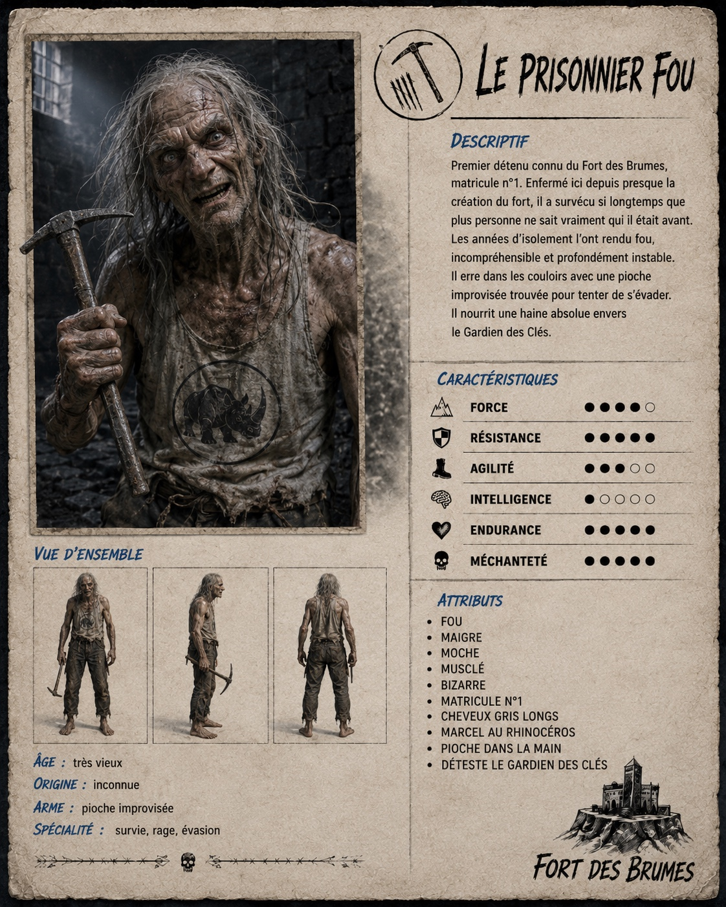

# Le Prisonnier fou

## Rôle et histoire

- Prisonnier matricule **numéro 1**.
- Présent dans le fort depuis sa création.
- Il a vieilli en captivité et semble avoir toujours été là.
- Il possède souvent une pelle trouvée pour tenter de s'évader.
- On pense qu'il a volé cette pelle au Père Nendaz.

## Caractère

- Complètement fou après toutes ces années.
- Il est devenu presque impossible à comprendre lorsqu'il parle.
- Il déteste viscéralement le Gardien des clés.

## Apparence

- Vieux.
- Laid.
- Musclé.
- Marcel portant le rhinocéros du Fort des Brumes.

## Salle

Sa pièce doit être une véritable cellule de prison.
