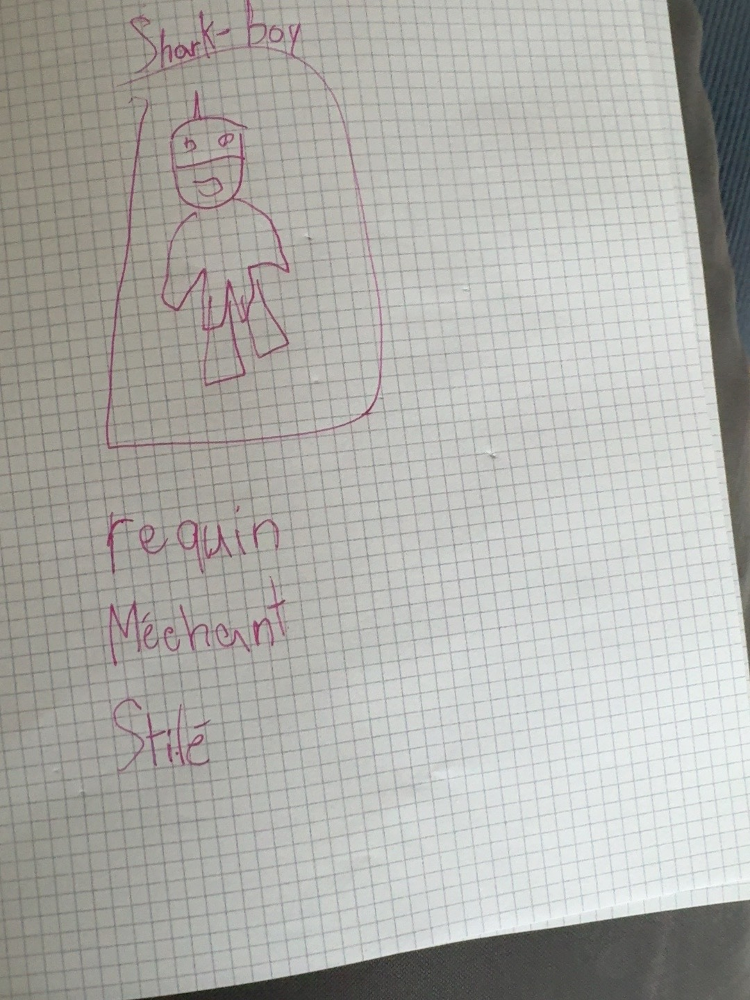

# Sharkboy

### Croquis source

## Origine et rôle

Sharkboy est un homme-requin pétrifié dans la glace il y a très longtemps. Il est associé à l'eau ; la formulation exacte de sa fonction reste à clarifier.

## Caractère

- Très méchant.
- Stylé.
- Impressionnant et costaud.

## Apparence

- Musclé.
- Forte mâchoire visible.
- Palmes aux pieds.
- Masque portant un aileron de requin sur la tête.
- Vêtements bleus ressemblant à une armure.

## Univers visuel

Il doit être montré dans un environnement de glace ou d'eau froide, en opposition directe avec Lava Girl.
