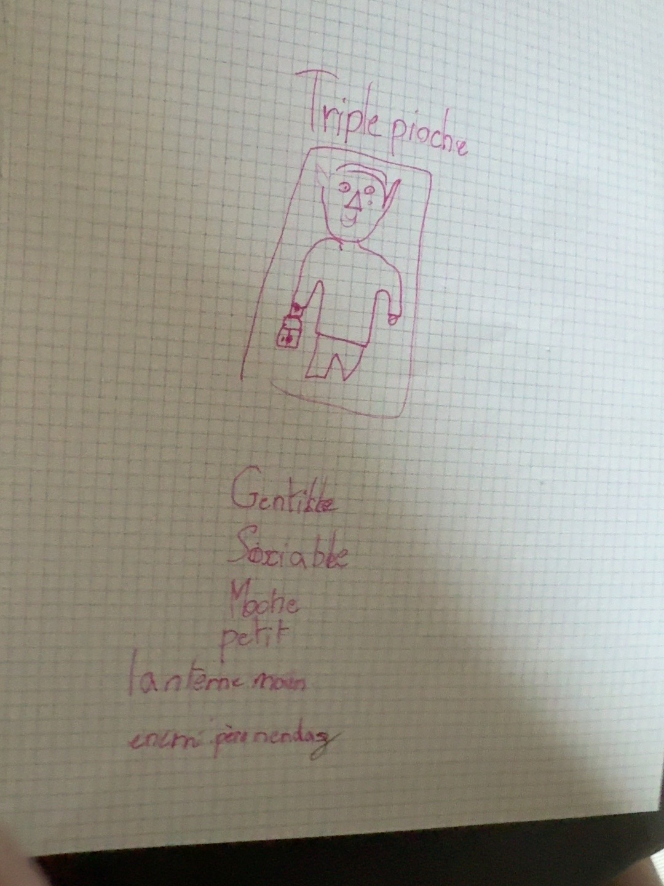

# Triple Pioche

### Croquis source

## Rôle

Triple Pioche est l'un des deux alliés des personnages qui vont affronter le fort. Il sert d'éclaireur et montre les portes grâce à sa lanterne.

## Caractère

- Gentil.
- Très, très social.
- Ennemi de tous les personnages du fort, à l'exception de l'autre allié.

## Apparence

- Très laid.
- Petit.
- Lanterne à la main.

## Relations

- Allié de Double Mine.
- Le croquis le décrit notamment comme ennemi du Père Nendaz.
